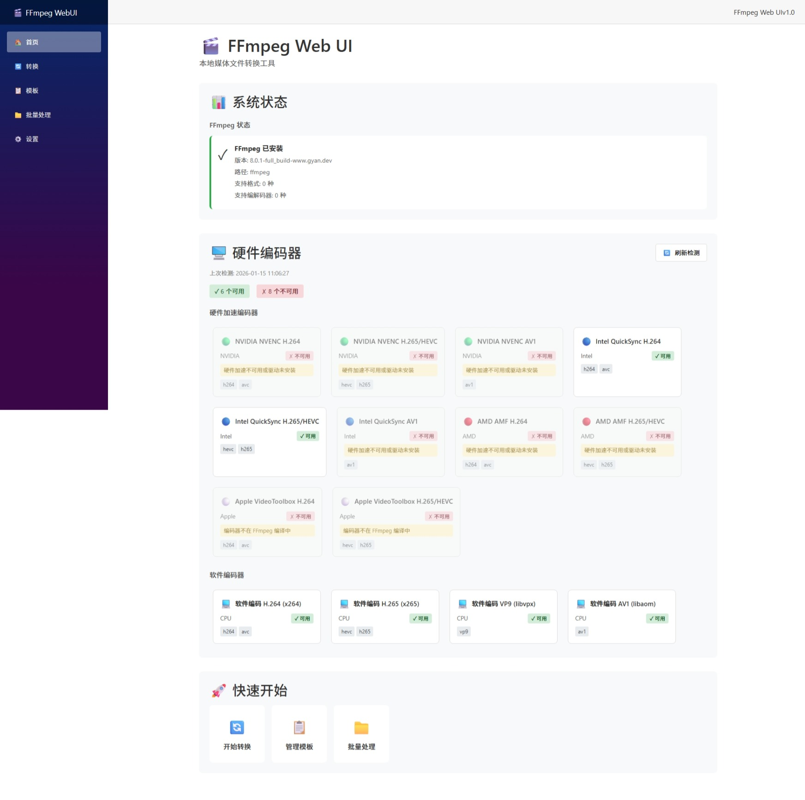
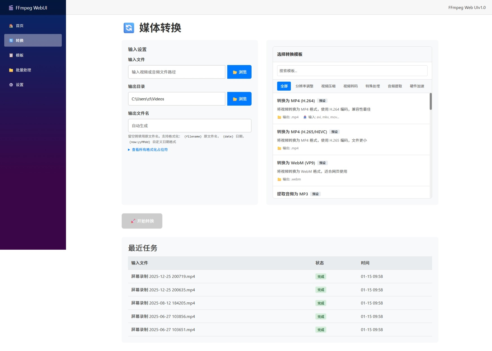
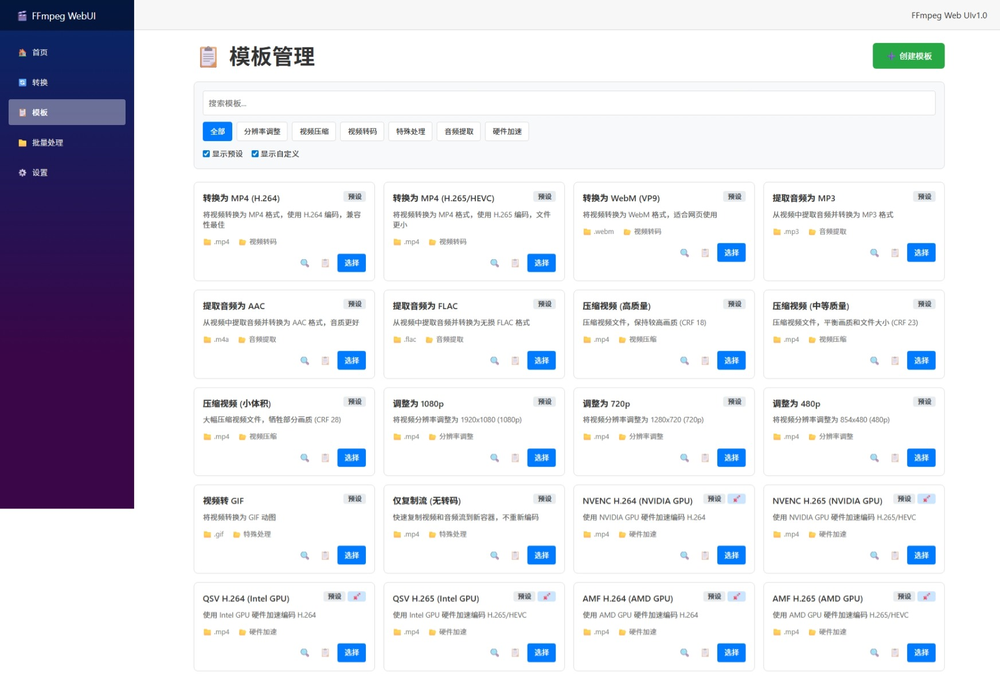
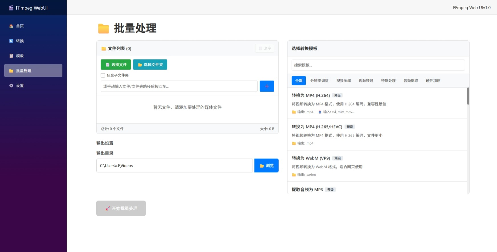
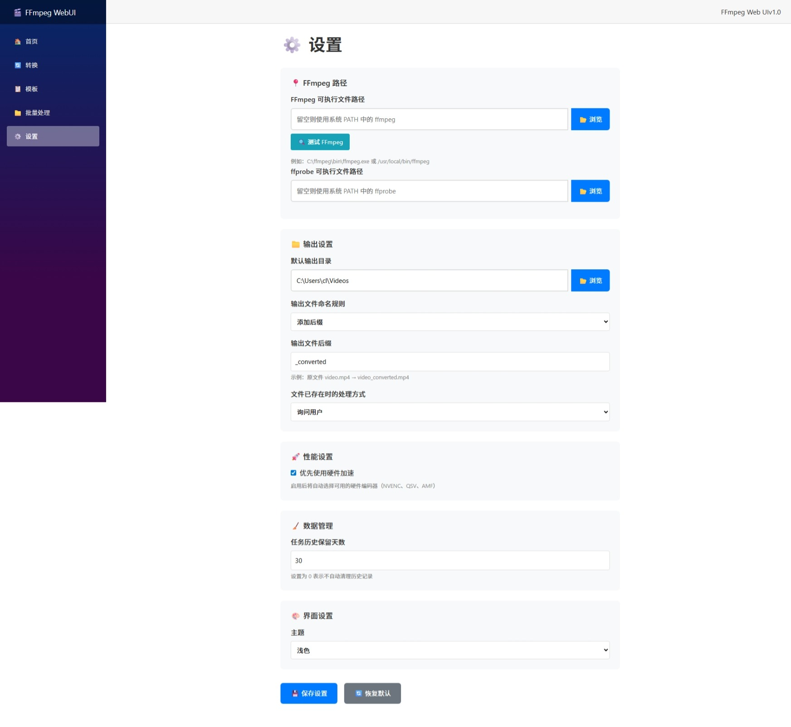

# FFmpegWebUI

一个**跑在你本机的 FFmpeg 图形界面**：用浏览器操作，转换在本机执行，不依赖任何云服务。
面向「不想记 FFmpeg 参数，但需要精确控制画质和硬件加速」的场景。

```
┌──────────────────────────────────────────────────────────┐
│  浏览器 (http://localhost:5265)                           │
│         ↕ Blazor Server（本地进程，仅监听 127.0.0.1）      │
│  FFmpeg / ffprobe  ← 本机 GPU 硬件编码器                  │
└──────────────────────────────────────────────────────────┘
```

## 截图

| 首页 | 转换 |
| --- | --- |
|  |  |

| 模板 | 批量 |
| --- | --- |
|  |  |

| 设置 |
| --- |
|  |

---

## 主要能力

### 跨平台硬件编码加速

会自动探测本机**真实可用**的硬件编码器，并且**用真实参数试跑验证**，而不是只看编码器名字在不在列表里。

| 平台 | 支持的硬件编码 |
| --- | --- |
| Windows | NVIDIA NVENC（H.264/H.265/AV1）、Intel QSV、AMD AMF、Windows Media Foundation、Vulkan Video |
| macOS | Apple VideoToolbox（H.264 / H.265 / ProRes） |
| Linux | Intel / AMD VA-API、NVIDIA NVENC、Intel QSV、Vulkan Video |

几点设计取舍：

- **同一份模板在所有平台通用。** 模板写 `-c:v {encoder} {quality_args}`，应用会按当前机器挑选编码器，
  并把质量参数展开成该编码器真正支持的写法（NVENC 用 `-cq`，QSV 用 `-global_quality`，
  VideoToolbox 用 `-q:v`，VA-API 用 `-qp`，软件编码用 `-crf`）。
- **两档试跑。** 先试「完整参数」，失败再试「最简参数」。因此不同 FFmpeg 构建之间的选项差异不会误判为不可用，
  真的不可用时也会把 FFmpeg 的原始报错显示出来。
- **硬件失败自动回退。** 如果硬件编码器初始化失败，且设置里开启了回退，会改用软件编码重试一次，
  任务不会因为一个驱动问题直接失败。
- **绝不把决定权交给 FFmpeg 的交互提问。** 所有「文件已存在」的分支都由应用预先决定（覆盖/跳过/重命名），
  不会出现进程卡在等待输入、进度条永远停在 0% 的情况。

### 模板

- 内置 40+ 个预设模板，覆盖转码、压缩、分辨率、音频提取、水印、字幕、抽帧、变速等常见需求。
- 每个模板可以声明**参数**（质量、码率、预设、宽度…），界面会自动生成对应控件，而不是让你手写命令。
- **模板试运行**：保存或使用前先拿一段自动生成的测试片段跑一遍，直接告诉你这个模板在本机能不能用、用的是哪个编码器。
- **模板校验**：缺少 `{input}`/`{output}`、引号不成对、占位符没有取值、在硬件编码器上使用 `-crf`
  这类问题都会在界面里明确指出来。
- 模板可以导入/导出 JSON，方便备份与分享。
- 系统预设带版本号，升级应用时会**自动增量同步**内置模板，同时保留你自己创建和修改的模板。

### 任务

- 转换在**后台队列**里执行：页面跳转、刷新、甚至断线重连都不会中断正在进行的转换。
- 并发数可配置；日志有长度上限，不会因为长时间录制把内存吃满。
- 支持优雅停止（发送 `q` 让 FFmpeg 写完文件尾，产出文件仍然可用）与强制终止。
- 失败/取消的任务可以一键重试；批量处理支持重试全部失败项。

### 交互

- 跨平台原生文件/文件夹选择器：macOS 用 `osascript`，Linux 用 `zenity`/`kdialog`，Windows 用系统对话框。
  任何平台不可用时都会明确提示，而不是按钮点了没反应。
- 浅色 / 深色 / 跟随系统主题，所有界面元素都跟随主题变量。
- 全局轻提示、确认对话框、键盘 Esc 关闭弹窗、可见的键盘焦点。
- 完整命令实时预览，并支持一键复制到剪贴板（复制失败会提示原因）。

---

## 环境要求

| 项目 | 要求 |
| --- | --- |
| .NET | **.NET 10 SDK**（仅自行编译时需要）；**发布版本自带运行时，用户无需安装** |
| FFmpeg | **推荐 7.x 或更新，最新 9.x 已完整支持** |
| 浏览器 | Chrome / Edge / Safari / Firefox 任一现代浏览器 |

### 安装 FFmpeg

| 平台 | 命令 |
| --- | --- |
| Windows | `winget install Gyan.FFmpeg` 或 `choco install ffmpeg`，或从 [gyan.dev](https://www.gyan.dev/ffmpeg/builds/) 下载后把 `bin` 加入 PATH |
| macOS | `brew install ffmpeg` |
| Debian / Ubuntu | `sudo apt install ffmpeg` |
| Fedora / RHEL | `sudo dnf install ffmpeg`（需要启用 RPM Fusion） |
| Arch | `sudo pacman -S ffmpeg` |

> 想要更完整的 QSV / VA-API 支持，Linux 上可以用 [jellyfin-ffmpeg](https://github.com/jellyfin/jellyfin-ffmpeg)。
> 应用会优先探测 `/usr/lib/jellyfin-ffmpeg/`。

也可以把 `ffmpeg` / `ffprobe` 放进项目根目录的 `tools/ffmpeg/`，发布时会一起打包，用户就不用自己装 FFmpeg 了。

### 关于 FFmpeg 版本

应用会在启动时读取 FFmpeg 主版本号，并据此给出提示。需要注意的是：

- **FFmpeg 9.0 移除了 `-vsync`**（改用 `-fps_mode`）、`-filter_complex_script`、`-top`，
  以及一批 NVENC 旧选项。内置模板不使用这些选项，因此在新旧版本上都能工作。
- 若你手动编辑模板，请避免使用上述已移除的选项。
- 部分编码器（如 `av1_qsv`、`h264_vulkan`）只在较新的构建中存在。应用不会假设"某个版本一定有某个编码器"，
  一切以实际试跑结果为准。

---

## 快速开始

### 方式一：使用发布版本（推荐）

1. 从 Releases 下载对应平台的包并解压。
2. 运行 `FFmpegWebUI`（Windows 为 `FFmpegWebUI.exe`）。
3. 浏览器会自动打开 `http://localhost:5265`。若 FFmpeg 未安装，首页会给出指引。

### 方式二：从源码运行

```bash
git clone <repo>
cd FFmpegWebUI
dotnet run
```

开发模式地址：<http://localhost:5265>

### 自行打包

```bash
./scripts/publish.sh              # 自动识别当前平台
./scripts/publish.sh osx-arm64    # 指定运行时
./scripts/publish.sh all          # 全部平台
```

产物在 `dist/<runtime>/`，自包含、目标机器无需安装 .NET。

---

## 使用说明

### 转换

1. 选择输入文件（会自动读取时长、分辨率、编码格式）。
2. 选择输出目录与文件名（文件名支持 `{filename}`、`{date}`、`{now:yyMMdd_HHmm}`、`{random:6}` 等占位符）。
3. 选择模板。不可用的模板会被标灰并说明原因（例如「需要 NVIDIA NVENC，本机不可用」）。
4. 调整模板参数（质量、码率、预设等）。
5. 确认命令预览无误后点击「开始转换」。

输出文件已存在时，会按「设置 → 文件已存在时的处理方式」处理，并在预览区明确提示将要覆盖还是改名。

### 批量处理

添加多个文件（可以一次粘贴多行路径，或扫描整个文件夹），选好模板后开始。
所有任务会进入队列，可以随时切换页面；处理期间每个文件的状态和失败原因都会显示出来。

### 模板

- 「模板」页可以浏览、搜索、按分类和可用性筛选，也可以复制预设改成自己的模板。
- 「模板管理」页（`/templates-admin`）可以对系统预设做完整增删改，以及导入/导出。

---

## 配置

`appsettings.json`：

```jsonc
{
  "FFmpegWebUI": {
    "DatabasePath": "",      // 留空 = 跨平台应用数据目录
    "ListenPort": 5265,      // 0 = 自动挑选空闲端口
    "AutoOpenBrowser": true
  }
}
```

环境变量：

| 变量 | 作用 |
| --- | --- |
| `FFMPEGWEBUI_DATA_DIR` | 覆盖数据目录（数据库位置） |
| `FFMPEGWEBUI_BIND` | 覆盖监听地址。默认 `127.0.0.1`；设为 `0.0.0.0` 才能局域网访问 |
| `FFMPEGWEBUI_PORT` | 覆盖监听端口 |
| `FFMPEGWEBUI_NO_BROWSER` | 设为 `1` 则启动时不自动打开浏览器 |

命令行：`FFmpegWebUI --port 8080`

### 安全说明

应用默认**只监听 127.0.0.1**，并且 `AllowedHosts` 限定为本机地址。
这是有意的：这个界面能在本机执行 FFmpeg 并读写任意文件，不应默认暴露到局域网。

如果你确实需要远程访问，请设置 `FFMPEGWEBUI_BIND=0.0.0.0`，并自行在前面加一层带认证的反向代理。
`/templates-admin` 页面**没有登录校验**，暴露出去等于把模板管理权限交给任何能访问该端口的人。

### 数据位置

| 平台 | 路径 |
| --- | --- |
| Windows | `%LOCALAPPDATA%\FFmpegWebUI\data.db` |
| macOS | `~/Library/Application Support/FFmpegWebUI/data.db` |
| Linux | `~/.local/share/FFmpegWebUI/data.db` |

删除 `data.db` 会清空模板（内置预设会在下次启动时重建）、任务历史和设置。

---

## 开发

```
Components/
  Layout/          导航与主框架
  Pages/           转换、批量、模板、模板管理、任务、设置、首页
  Shared/          文件选择器、模板选择器/编辑器/详情、日志、进度、参数编辑器、模态框
Services/
  FFmpegService         进程执行、进度解析、能力探测（版本/格式/编码器/hwaccels）
  EncoderCatalog        编码器参数画像（质量/预设/显存上传/容器参数）
  CommandLineBuilder    模板分词与占位符替换
  HardwareDetectionService  硬件编码器探测（两档试跑 + 缓存）
  ConversionQueue       后台执行队列
  TaskService           任务 CRUD
  TemplateService       模板 CRUD、校验、试运行、导入导出
  FFmpegLocator         FFmpeg 可执行文件定位
  AppPaths / FileDialogService / ToastService / AppStatusService
docs/
  ui-conventions.md                     UI 约定（颜色令牌、共享组件、服务契约）
  ffmpeg-8-9-breaking-changes-report.md  FFmpeg 8/9 破坏性变更调研（含来源）
tools/verify/                           离线验证工具（模板实测 + 管线回归）
scripts/publish.sh                      多平台打包脚本
```

构建：

```bash
dotnet build
```

### 离线验证

`tools/verify` 是一个不启动界面的验证工具，直接调用与界面相同的服务，
用来确认「FFmpeg 定位 → 能力探测 → 硬件检测 → 模板能否真正执行 → 转换队列」整条链路：

```bash
dotnet run --project tools/verify              # 检查全部
dotnet run --project tools/verify pipeline     # 只检查转换管线
dotnet run --project tools/verify templates    # 只检查内置模板
```

它会：

- 用真实 FFmpeg 逐个执行**所有内置模板**，并校验展开后的命令里没有残留占位符、没有空参数；
- 走一遍完整的转换流程（建任务 → 入队 → 执行 → 进度 → 输出校验），验证四种覆盖策略、取消与半成品清理、中断恢复；
- 校验模板检查器能否拦住「缺少 `{input}`/`{output}`」「引号不成对」「占位符未声明」「硬件编码器上用 `-crf`」等错误；
- 验证**安全与设置真的生效**：输出路径指向输入时必须自动改名（不毁源文件）、
  「优先使用硬件解码」确实注入 `-hwaccel` 且位置在 `-i` 之前、批量任务遵循命名规则、
  声明了「必须用某厂商硬件」的模板在本机缺该硬件时被明确拒绝而不是偷偷换别的编码器；
- 验证**文件选择器返回的路径可用**：macOS 的 AppleScript 会返回
  `alias Macintosh HD:Users:…` 这类文件引用而不是路径，这里同时检查转换逻辑，
  以及用 `osacompile` 检查生成的 AppleScript 语法正确（不会弹窗，纯静态校验）。

当前结果（macOS + FFmpeg 9.0.2）：**99 项检查全部通过**。

- 50 个模板实测可执行；
- `画面 · 烧录字幕（硬字幕）`因为本机 FFmpeg 未编译 `libass` 而被正确跳过，界面里显示为不可用；
- NVENC / QSV / AMF / VA-API 共 8 个「必须用指定厂商硬件」的模板在本机被**正确拒绝**
  （给出「本机没有 NVIDIA NVENC」这类可读原因，而不是换用别的 GPU 编码器跑出结果）。

发布包会随附运行所需文件；`/api/health` 返回版本、平台与 FFmpeg 解析结果，便于排查。

---

## 许可

见 [LICENSE](./LICENSE)。
